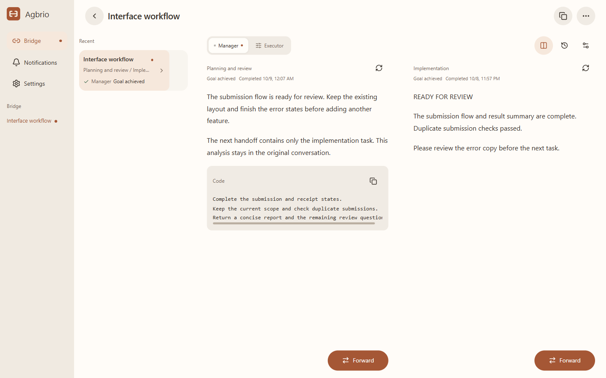
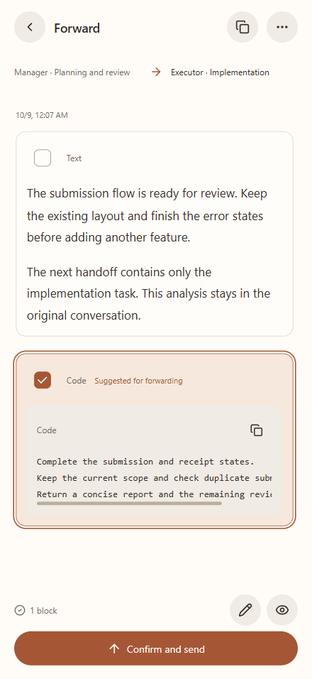
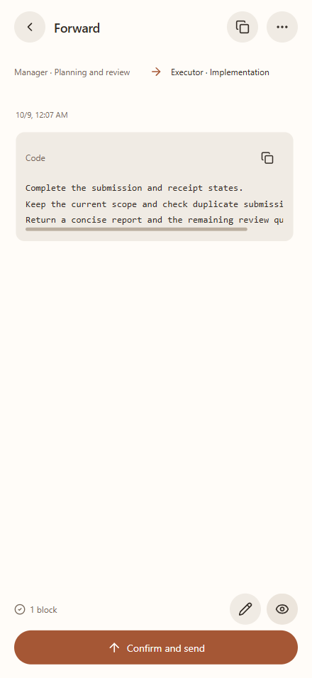
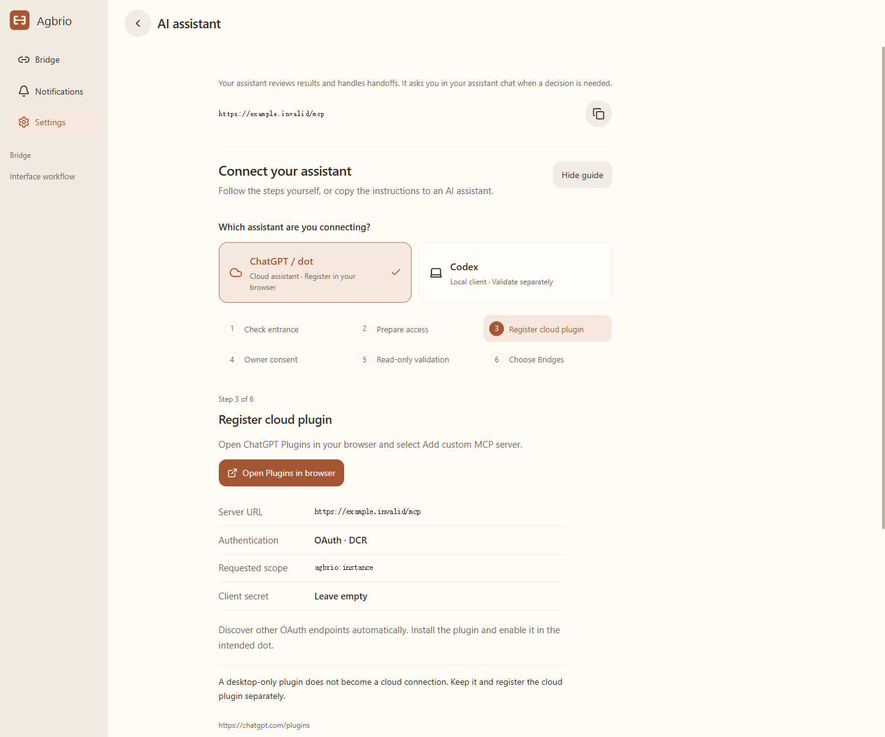

# Agbrio

**Agent Bridge — 판단과 검토를 맡는 대화, 실행을 맡는 대화를 연결합니다.**

[English](README.md) · [简体中文](README.zh-CN.md) · [繁體中文](README.zh-TW.md) · [日本語](README.ja.md) · [한국어](README.ko.md)

계획용 대화와 실행용 대화를 따로 사용하시나요? Agbrio는 이 작업 방식에 맞춘 인계 도구입니다. 결과를 읽고, 다음 작업에 필요한 부분을 선택하고, 받을 대화를 확인한 뒤 전달합니다. 두 대화의 문맥을 유지하면서 여러 프로젝트에서도 정확한 대상으로 보낼 수 있습니다.

[Windows v0.1.25 다운로드](https://github.com/geoffrey1111/agbrio/releases/tag/v0.1.25) · [설치와 연결](docs/SETUP.md) · [MIT](LICENSE)

## 검토에서 다음 작업까지

관리 대화는 계획, 증거 검토, 다음 판단을 맡습니다. 실행 대화는 프로젝트를 변경하고 보고합니다. Bridge는 제목이나 화면 위치가 아닌 정확한 대화 ID로 두 역할을 연결합니다.

 

분석은 원래 대화에 남기고 지시만 전달할 수 있습니다. 문단과 파일을 선택하고 최종 내용과 수신 대상을 확인하세요. 작업이 정체된 뒤의 짧은 업데이트뿐 아니라 이전의 자세한 결과도 검토할 수 있습니다. 알림, Bridge 외 대화 감시, 원래 대화에 답장, 지원되는 Codex 질문 응답, 서명된 앱 업데이트도 제공합니다.

화면은 실제 Agbrio 구성 요소를 브라우저에서 렌더링하고 가상 데이터를 사용했습니다. 한국어는 제품 소개 번역입니다. **앱 UI는 영어·중국어 간체·중국어 번체를 지원**하며 이 페이지의 이미지는 영어입니다. 실제 iPhone 녹화가 아닙니다.

## AI 비서와 협업

Settings → AI assistant의 6단계 안내에서 ChatGPT / dot 클라우드와 Codex 로컬을 먼저 선택합니다. 자신의 HTTPS MCP 주소와 유효한 권한을 사용하고, 본인이 OAuth에 동의한 다음 대상 비서에서 도구를 확인합니다. 로컬 ready 상태만으로 클라우드 연결이 성공한 것은 아닙니다. 직접 따라 하는 안내와 복사 가능한 AI 지침을 함께 제공합니다.

INSTANCE + CONVERSATION_REVIEW 권한은 30일이며 취소할 수 있습니다. 비서는 먼저 어떤 Bridge를 맡을지 묻습니다. 작업, 전달 방향, 반드시 물어볼 상황, 중단 조건을 합의한 후 일상적인 인계를 검토하고 진행합니다. 해결되지 않은 결정은 사용자에게 질문하고 실제 답변을 기록합니다. 전체 앱 접근 권한만으로 모든 Bridge가 위임되지는 않습니다.

0.1.25는 공식 MCP Events를 구현합니다. 이벤트로 깨어난 뒤 사용자 승인 범위 스캔을 통해 격리 테스트의 단일 전달과 수신 결과를 확인했습니다. 이벤트 결과 자동 주입은 아직 해결되지 않았으며 무인 전체 E2E 검증은 아닙니다.[Events guide](docs/MCP_EVENTS_WORKFLOW.md) · [Goal recovery limits](docs/GOAL_RECOVERY.md).

## 연결과 실행 조건

기존 Cloudflare Tunnel, Tailscale Funnel / Serve 또는 HTTPS 서비스를 유지할 수 있습니다. 운영자가 제공하는 코드로 활성화하는 호스팅 연결은 선택 사항이며 자체 호스팅도 가능합니다. 인스턴스별 자격 증명과 라우팅을 분리하며 모든 사용자에게 하나의 MCP 자격 증명을 제공하지 않습니다. 컴퓨터를 켜고 네트워크 연결을 유지한 상태에서 휴대폰 PWA를 페어링합니다.

현재 Alpha 범위는 Windows x64 + Codex + PWA입니다. macOS와 다른 실행 Agent는 검증된 대상이 아닙니다. 인계 수락은 후속 작업 완료를 뜻하지 않습니다. 선택한 파일은 수신 프로젝트에 복사되며 경로와 SHA-256이 포함됩니다.[소스 빌드](docs/BUILD.md) · [비서 프로토콜](docs/ASSISTANT_MCP.md).

[작성자 연락처](mailto:geoffreyzjx@qq.com) · [문제 제보](https://github.com/geoffrey1111/agbrio/issues/new?template=bug_report.yml) · [개선 제안](https://github.com/geoffrey1111/agbrio/issues/new?template=feature_request.yml)

## 사용량과 연결 안내

Codex의 실제 사용량 기간, 잔여량과 초기화 시간을 확인하고 수동 새로고침할 수 있습니다. AI 도우미 연결은 클라우드/로컬 경로를 선택하고 설정 지침을 복사합니다. 사용자는 인증과 위임할 Bridge 선택을 담당합니다. PWA 설정에서 수동 업데이트할 수 있으며 재설치나 재페어링은 필요하지 않습니다.
