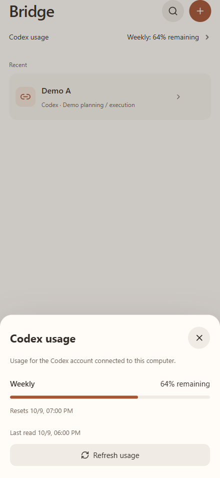
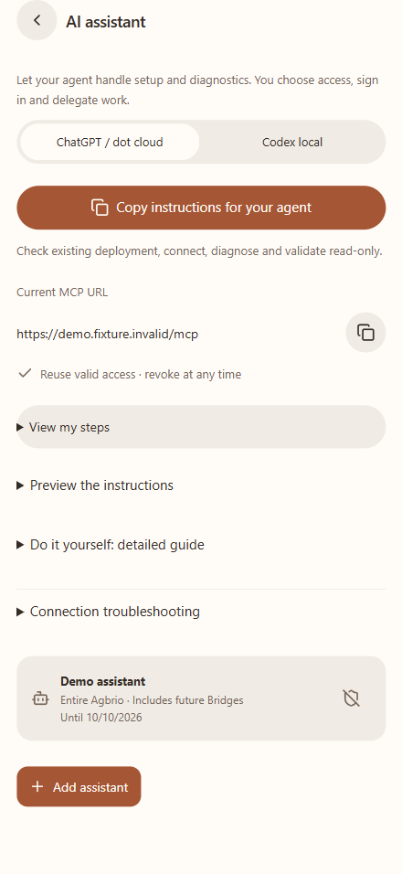

# Agbrio

**Agent Bridge — one conversation plans and reviews; another executes.**

[English](README.md) · [简体中文](README.zh-CN.md) · [繁體中文](README.zh-TW.md) · [日本語](README.ja.md) · [한국어](README.ko.md)

Do you already keep one agent conversation for decisions and another for implementation? Agbrio connects those existing contexts. Read the result, select what belongs in the next task, check the recipient, and hand it over.

**Keep the reasoning in one conversation. Keep the execution in another. Carry the right work between them.**

[Download Windows v0.1.17](https://github.com/geoffrey1111/agbrio/releases/tag/v0.1.17) · [Install and pair](docs/SETUP.md) · [Connect an assistant](docs/ASSISTANT_CONNECTION_GUIDE.en.md) · [MIT license](LICENSE)

## From review to the next task

The manager keeps the plan, evaluates returned evidence, and decides the next step. The executor works in the project and reports back. A Bridge binds their exact conversation IDs, so the handoff goes to the intended conversation even when several projects run in parallel.

 

Select only the instruction block. The analysis remains in its original conversation. Preview the final message and recipient, then confirm. Read the next result from your desktop or paired phone PWA.

These are browser-rendered screenshots of actual Agbrio components with fictional, localized data. They are not two Codex windows or physical-device recordings.

## A focused workspace for handoffs

| Capability | What it helps you do |
| --- | --- |
| Exact Bridge bindings | Keep manager and executor conversations separate and deliver by stable IDs |
| Selective forwarding | Choose whole paragraphs, review files, edit the outgoing message, and confirm its recipient |
| Earlier results | Review a useful earlier result when later stalled-goal updates are less informative |
| Activity and review attention | See the active side; review attention appears when intervention is needed |
| Watches and notifications | Follow conversations outside a Bridge and reply to the original conversation |
| Native Codex questions | Answer supported questions and choices through the app |
| Desktop Host + phone PWA | Review and hand off away from the desk while your computer stays online |
| Signed app updates | Check, download and install verified Windows updates from Settings |

Selected Codex files are copied to the destination project's `.aiwr/incoming/<handoff-id>/`, with relative paths and SHA-256 in the outgoing message. They are local project materials, not a claim that ChatGPT received an uploaded attachment.

## Let your assistant help with review

Settings → AI assistant now has a visible six-step tutorial and copyable instructions. Choose **ChatGPT / dot cloud** or **Codex local** first. Use your instance's actual HTTPS MCP address, reuse a valid authorization, complete owner consent, and verify tools in the target assistant. A desktop-ready indicator is not cloud acceptance.

For whole-app access, Agbrio offers a revocable 30-day **INSTANCE + CONVERSATION_REVIEW** authorization. After connecting, the assistant asks **which Bridges you want it to handle**. Agree the task, direction, questions that need your decision, and pause conditions in that conversation. A grant alone does not delegate every Bridge.

Within your explicit delegation, ordinary reviewed handoffs can proceed without a phone approval every round. Conflicts, scope changes and unresolved decisions come back to you. Agbrio reuses prepare → confirm → receipt, exact versions, decision records and duplicate-send protection.

The owner reports dot discovered 16 tools and passed `read_app`, `read_bridge` and `read_source`. Live dot writes have not yet been accepted in this release. MCP event subscription and automatic wakeup are not implemented; connecting does not start an unattended loop. [Manual steps and troubleshooting](docs/ASSISTANT_CONNECTION_GUIDE.en.md) · [Copy-to-AI instructions](docs/ASSISTANT_COPY_PROMPT.en.md).

## Reach your own Host

Keep your existing deployment. Desktop Settings → Devices supports your own Cloudflare Tunnel domain, Tailscale Funnel / Serve, or an existing HTTPS entry. You can also use an optional operator-issued hosted redemption code; self-hosting remains available. The setup can generate instructions for your deployment assistant. Hosted connection credentials and tenant routing remain separate per activated instance; no shared MCP credential is supplied to users.

The computer must stay powered on, awake and connected for live work. A new browser session may require pairing; an already valid session should be reused. [Setup](docs/SETUP.md) · [Hosted option](docs/HOSTED_RELAY.md).

## Release and participation

Windows x64 + Codex + paired PWA is the alpha scope. App languages: **English, Simplified Chinese, Traditional Chinese** (Settings → Language). Japanese and Korean are introduction translations; macOS and other execution agents are not verified release targets. Source data is review material, never a way to enlarge authorization. An accepted handoff does not prove its downstream task completed.

[Build from source](docs/BUILD.md) · [Assistant protocol](docs/ASSISTANT_MCP.md) · [v0.1.17 changes](docs/RELEASE_0.1.11.md) · [Third-party notices](THIRD_PARTY_NOTICES.md)

[Contact the author](mailto:geoffreyzjx@qq.com) · [Report a problem](https://github.com/geoffrey1111/agbrio/issues/new?template=bug_report.yml) · [Suggest an improvement](https://github.com/geoffrey1111/agbrio/issues/new?template=feature_request.yml)

## Native usage and simpler assistant setup

## Quick setup with your agent

In **Settings → AI assistant**, choose **ChatGPT / dot cloud** or **Codex local**, then **Copy instructions for your agent**. The prompt uses your configured instance URL. Your agent checks existing deployment and access; you choose authorization, sign in and consent, and tell the assistant which Bridges to handle. Valid grants are reused. Detailed self-service steps remain under **Do it yourself: detailed guide**. Desktop authentication alone does not prove cloud readiness.

Bridge now has a quiet **Codex usage** row. Open it to see native quota windows, remaining percentage, reset time, last reading and **Refresh usage**. Sparse or unsupported accounts show unavailable, and offline readings are labelled. No inferred five-hour bucket or quota purchases. Phone **Settings** and **About** include **Check interface updates**; prepared changes apply on your click, with pending writes protected. Do not reinstall or pair again.

 

These use actual UI components and fictional demo data; they are browser captures, not physical iPhone recordings.
