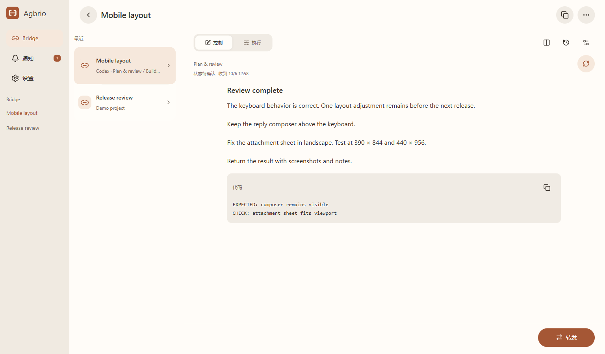
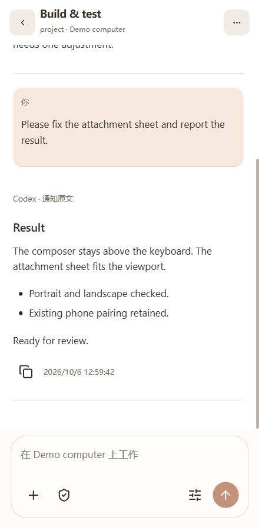

# Agbrio

**Agent Bridge · 连接你的 Agent 对话**

[English](README.md) · [简体中文](README.zh-CN.md) · [繁體中文](README.zh-TW.md) · [日本語](README.ja.md) · [한국어](README.ko.md)

Agbrio 是面向开发者的个人桌面与手机协作工具。电脑保持运行，你可以在手机上查看 Agent 的结果，挑选下一条对话需要的指令和材料，最后一次确认完成交接。

例如，让一个 Codex 对话负责规划和审查，另一个对话负责实现。Agbrio 保留两端的明确身份，帮助你把选定的内容送到正确的原对话。

## 发布状态

**正在准备开源发布。** 个人 Windows／Codex 实现已在使用，作者已反馈手机转发成功。目前这个公开仓库提供项目介绍、配图与自部署方案；**尚未发布应用源码、安装包、可用的安装命令或选定的开源许可证**。

## 电脑工作台，手机随身查看

 

配图使用真实应用组件和虚构示例对话，通过浏览器渲染。没有公开私人工作内容，也不代表 iPhone 或 Mac 真机验收。应用控件目前为中文；多语言 README 不代表应用已完成多语言适配。

## 个人版本目前能做什么

- **Bridge 双端协作** — 绑定已有的控制端与执行端对话。查看任意一端，按相反方向把执行结果交回控制端。
- **选择内容后交接** — 阅读完整原文，整块勾选需要的段落，修改发送内容，看清接收端，最后一次确认发送。指令块识别只是建议，发送什么由你决定。
- **带齐材料** — 选中的 Codex 交接文件会复制到接收端项目的 `.aiwr/incoming/<handoff-id>/` 目录，消息附上相对路径和 SHA-256。接收端读取的是实际本地副本；这不等于把文件上传成 ChatGPT 对话附件。
- **通知与原对话回复** — 打开具体的结果通知，直接回复对应的原对话。公开的用户消息和 Agent 回复从旧到新排列，更早的消息在上方加载。
- **桌面 Host ＋手机 PWA** — 电脑端保存绑定、观察结果和发送记录，手机使用配对后的网页会话。实时读取和发送需要电脑开机、保持唤醒并联网。

## 一次完整交接

1. 创建 Bridge，绑定准确的控制端和执行端对话。
2. 阅读控制端回复，选择指令块与需要的材料。
3. 核对接收端，点击一次「确认发送」。
4. 执行端返回结果后，审阅并选择内容，再交回控制端。

## 手机如何连接电脑

概念结构：手机操作电脑 Host，Host 连接两端 Agent 对话。「HTTPS 入口」代表用户选择的网络服务，不是 Agbrio 托管的账号服务。

目前个人环境使用 Cloudflare Tunnel 提供 HTTPS 入口。Cloudflare 负责网络路径，应用状态和请求仍由电脑 Host 处理。PWA 可以先显示缓存界面，但缓存内容不能证明电脑当前在线。

后续自部署流程计划允许用户选择自己的连接方式。下面列的是规划选项，当前应用还没有可用的通用选择器。

- **Cloudflare Tunnel** — 适合已有 Cloudflare 托管域名的用户。
- **Tailscale Funnel** — 计划提供使用服务商域名的公网 HTTPS 入口，无需购买自己的域名。
- **Tailscale Serve** — 计划提供私有网络入口，两端都需要使用 Tailscale。
- **自己的 HTTPS 代理或隧道** — 计划供已有远程访问配置的用户使用。

[自部署设计与 Agent 配置指令草稿](docs/SELF_HOSTING_PLAN.zh-CN.md)

## 确认、数据与送达

- 使用准确的 conversation／thread 标识绑定目标，不按标题、截图或界面位置猜测。
- 每次交接需要用户明确确认，不建立自动循环的管理端／执行端工作流。
- 送达不确定时保留该状态，先核对记录，不盲目重复发送。
- 选定文件的真实字节与哈希才是材料依据；只显示源电脑的路径，不能让远程接收端自动拿到文件。
- 自部署仍需信任选用的隧道／网络服务商和 Agent 服务商；手机缓存和本地留存的消息也是私人数据。

## 当前边界

当前个人使用路径是 Windows ＋ Codex。ChatGPT 集成仍属实验性功能，需要另行验证账号会话和完整收发链路。Claude Code、其他 Agent、macOS 与通用自部署流程均是后续工作，不是已发布的支持承诺。iPhone PWA 的布局和渲染问题仍在排查。目前不提供托管的多用户服务。

## 可用开源版本发布前

- 导出干净的源码，审查依赖和分发条件后确定许可证。
- 实现连接方式选择、连接验证和可交给 Agent 的部署指令。
- 在全新 Windows 环境验证安装、配对、恢复和文件交接；Mac 独立验证。
- 通过独立适配器扩展其他 Agent，分别验证真实读取与发送行为。

欢迎通过 [Issues](https://github.com/geoffrey1111/agbrio/issues) 提建议。反馈问题时附上界面版本、设备／系统、连接方式与复现步骤；公开前移除私人对话、路径、令牌与敏感截图。
