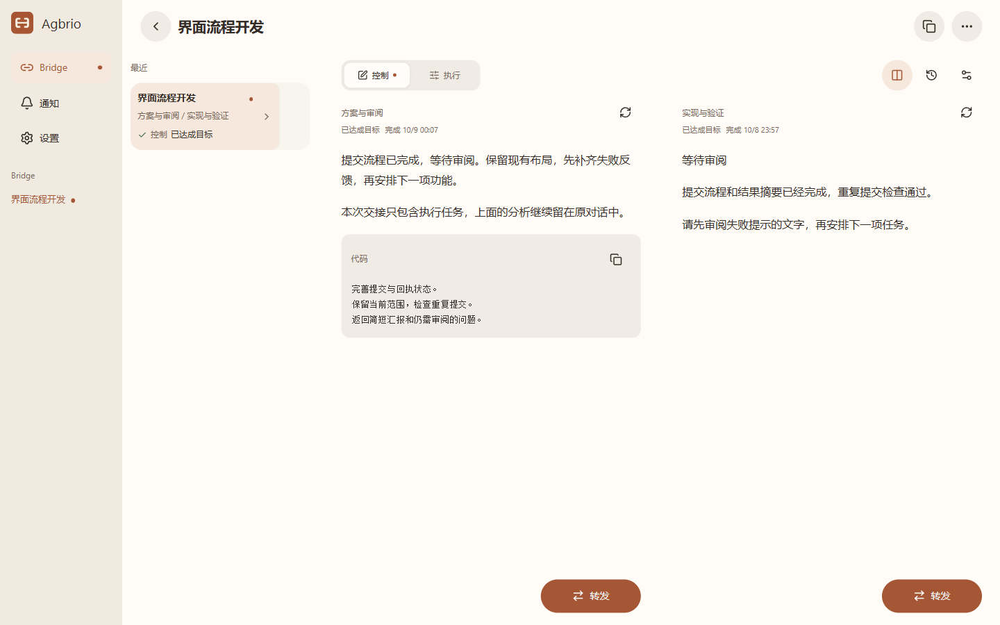
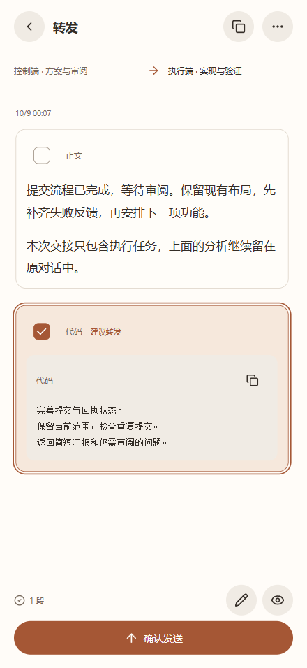
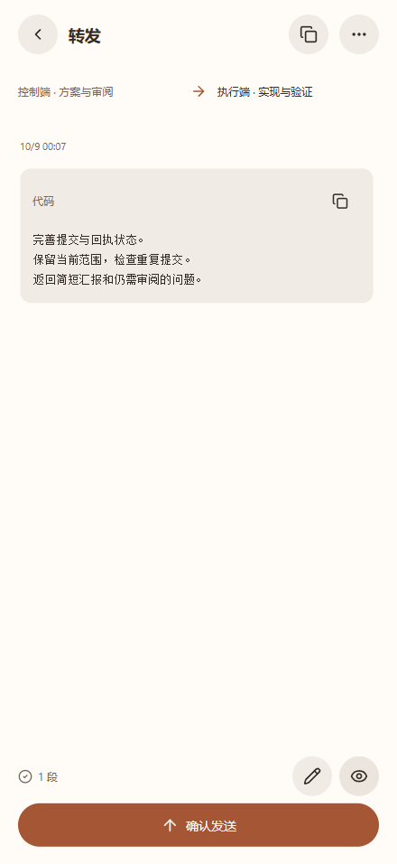

# Agbrio

**Agent Bridge — 一个对话负责决策与审阅，一个对话负责执行。**

[English](README.md) · [简体中文](README.zh-CN.md) · [繁體中文](README.zh-TW.md) · [日本語](README.ja.md) · [한국어](README.ko.md)

你是不是也用一个对话负责管理，一个负责执行？Agbrio 连接这两段已有上下文：读结果、选出下一轮需要的内容、核对接收端，再把工作交接过去。

**思考留在思考端，执行留在执行端，Bridge 负责准确交接。**

[下载 Windows v0.1.11](https://github.com/geoffrey1111/agbrio/releases/tag/v0.1.11) · [安装与配对](docs/SETUP.md) · [连接 AI 助手](docs/ASSISTANT_CONNECTION_GUIDE.zh-CN.md) · [MIT 许可证](LICENSE)

## 从审阅到下一项任务

管理端保留计划、分析证据、确定下一步；执行端在项目中完成工作并返回汇报。Bridge 绑定两端精确的对话 ID，多组项目并行时也能核对正确接收对象。

 

只选择需要交接的指令，分析仍留在原对话。预览最终文字和接收端，确认发送；在电脑或手机 PWA 上继续审阅下一次结果。手机让你离开桌前也能完成这一步，产品的核心仍是两段对话之间的交接。

截图使用实际 Agbrio 组件与独立虚构数据，界面和对话均为简体中文；属于浏览器预览，不冒充两个 Codex 窗口或手机真机录制。

## 为双对话工作方式准备的能力

| 能力 | 用途 |
| --- | --- |
| 精确 Bridge 绑定 | 按稳定 ID 交接，保持管理和执行上下文独立 |
| 选择性转发 | 选择整段、核对文件、编辑最终文字，确认接收对象 |
| 较早的完整结果 | 目标停滞后仍可审阅前面更有价值的汇报 |
| 当前状态与审阅提醒 | 聚焦正在工作的那一端，需要介入时提示审阅 |
| 监听与通知 | 持续关注 Bridge 外的对话，回复精确的原对话 |
| Codex 提问 | 在应用中回答支持的问题和选项 |
| 桌面 Host 与手机 PWA | 电脑保持在线，手机远离桌面审阅和交接 |
| 签名更新 | 在设置中检查、下载和安装经过验证的 Windows 更新 |

选中的 Codex 文件会复制到接收端项目的 `.aiwr/incoming/<handoff-id>/`，消息包含相对路径和 SHA-256；它是本地项目材料，不代表已上传成 ChatGPT 附件。

## 让 AI 助手参与审阅

设置 → AI 助手提供六步可视化教程，也能复制指令交给助手。先选择 **ChatGPT / dot 云端**或 **Codex 本地**：读取自己实例的完整 HTTPS MCP 地址，复用有效授权，由本人登录同意，在目标助手中发现工具并只读验收。桌面显示准备就绪不等于云端连接通过。

整个应用授权为 **INSTANCE + CONVERSATION_REVIEW**，默认 30 天，可撤销。连接后，助手先问“你希望我接管哪些 Bridge？”，再确认任务、方向、必须询问的情况与暂停条件。直接在助手对话中说明即可，不强制填写 Brief / Insight；整个应用可访问不等于所有工作都已委托。

明确委托内的常规交接，助手审阅后可以推进，不需要每轮回手机审批；要求冲突、超出范围或需要你决定时，再向你提问。沿用准备交接 → 核对与确认 → 查回执，保留版本、决策记录和防重复发送。

用户已报告 dot 发现 16 个工具，`read_app`、`read_bridge`、`read_source` 通过；真实 dot 写入尚未验收。事件订阅与自动唤醒尚未实现，连接 MCP 不代表已开启无人值守循环。[操作与排错](docs/ASSISTANT_CONNECTION_GUIDE.zh-CN.md) · [可复制指令](docs/ASSISTANT_COPY_PROMPT.zh-CN.md)。

## 连接自己的电脑

保留已有部署。在桌面设置 → 设备选择自己的 Cloudflare Tunnel 域名、Tailscale Funnel / Serve 或现有 HTTPS 入口；也可使用运营者提供的托管兑换码，自部署仍可使用。部署步骤可复制给自己的 AI 助手。托管激活后的实例凭据和租户路由独立，没有给所有用户一份共享 MCP 凭据。

实时读取与发送需要电脑开机、不休眠并联网；有效登录直接复用，新浏览器确实需要时再配对。[安装说明](docs/SETUP.md) · [托管选项](docs/HOSTED_RELAY.md)。

## 版本与参与

当前为 Windows x64 + Codex + 配对 PWA 的 Alpha。应用支持**简体中文、繁体中文、英语**，在设置 → 语言切换。日语和韩语目前仅翻译产品介绍；macOS 和其他执行 Agent 尚未列入已验证发行范围。来源正文不能扩大授权，收到交接回执不等于下游任务已经完成。

[从源码构建](docs/BUILD.md) · [助手协议](docs/ASSISTANT_MCP.md) · [v0.1.11 更新](docs/RELEASE_0.1.11.md) · [第三方声明](THIRD_PARTY_NOTICES.md)

[联系作者](mailto:geoffreyzjx@qq.com) · [反馈问题](https://github.com/geoffrey1111/agbrio/issues/new?template=bug_report.yml) · [提出建议](https://github.com/geoffrey1111/agbrio/issues/new?template=feature_request.yml)
