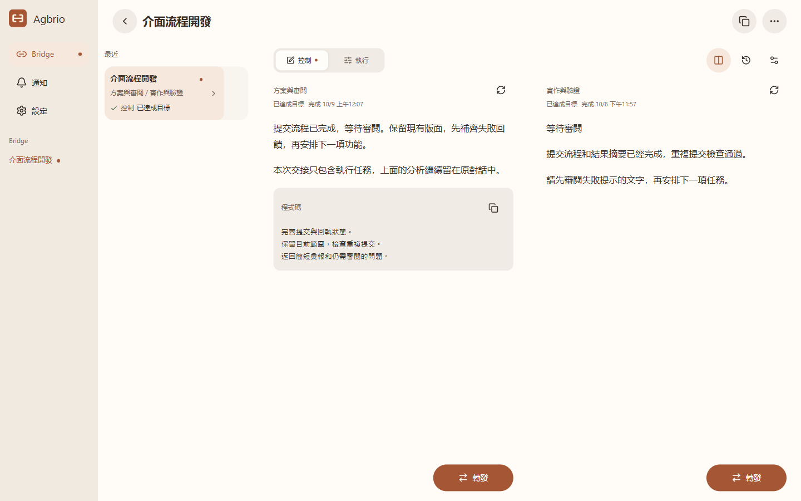
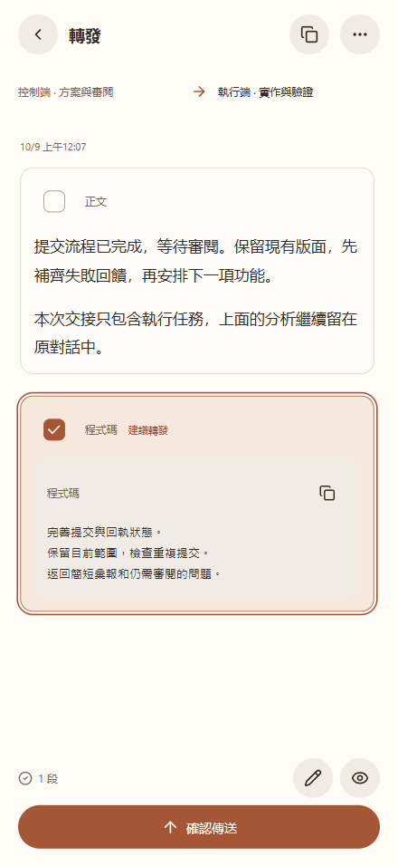
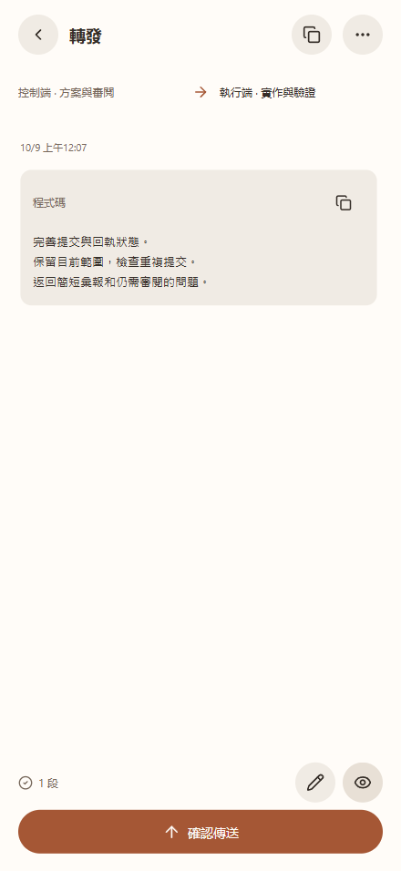
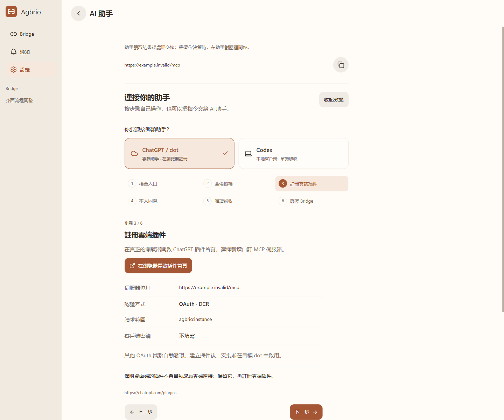

# Agbrio

**Agent Bridge — 一個對話負責決策與審閱，一個對話負責執行。**

[English](README.md) · [简体中文](README.zh-CN.md) · [繁體中文](README.zh-TW.md) · [日本語](README.ja.md) · [한국어](README.ko.md)

你是不是也用一個對話負責管理，一個負責執行？Agbrio 連接這兩段既有的上下文：讀取結果、選出下一輪需要的內容、核對接收端，再把工作交接過去。

**思考留在思考端，執行留在執行端，Bridge 負責準確交接。**

[下載 Windows v0.1.20](https://github.com/geoffrey1111/agbrio/releases/tag/v0.1.20) · [安裝與配對](docs/SETUP.md) · [連接 AI 助手](docs/ASSISTANT_CONNECTION_GUIDE.zh-TW.md) · [MIT 授權](LICENSE)

## 從審閱到下一項任務

管理端保留計畫、分析證據、決定下一步；執行端在專案中完成工作並回報。Bridge 綁定兩端精確的對話 ID，多組專案並行時也能核對正確的接收對象。

 

只選擇需要交接的指令，分析仍留在原對話。預覽最終文字和接收端，確認傳送；在電腦或手機 PWA 上繼續審閱下一次結果。手機讓你離開桌前也能完成這一步，產品核心仍是兩段對話之間的交接。

截圖使用實際 Agbrio 元件與獨立虛構資料，介面與對話均為繁體中文；屬於瀏覽器預覽，不冒充兩個 Codex 視窗或手機實機錄影。

## 為雙對話工作方式準備的能力

| 能力 | 用途 |
| --- | --- |
| 精確 Bridge 綁定 | 按穩定 ID 交接，保持管理與執行上下文獨立 |
| 選擇性轉發 | 選擇整段、核對檔案、編輯最終文字，確認接收對象 |
| 較早的完整結果 | 目標停滯後仍可審閱前面更有價值的彙報 |
| 目前狀態與審閱提醒 | 聚焦正在工作的那一端，需要介入時提示審閱 |
| 監聽與通知 | 持續關注 Bridge 外的對話，回覆精確的原對話 |
| Codex 提問 | 在應用中回答支援的問題與選項 |
| 桌面 Host 與手機 PWA | 電腦保持上線，手機離開桌面也能審閱與交接 |
| 簽章更新 | 在設定中檢查、下載與安裝經過驗證的 Windows 更新 |

選中的 Codex 檔案會複製到接收端專案的 `.aiwr/incoming/<handoff-id>/`，訊息包含相對路徑與 SHA-256；它是本地專案資料，不代表已上傳成 ChatGPT 附件。

## 讓 AI 助手參與審閱

設定 → AI 助手提供六步視覺化教學，也能複製指令交給助手。先選擇 **ChatGPT / dot 雲端**或 **Codex 本地**：讀取自己實例的完整 HTTPS MCP 位址、沿用有效授權、由本人登入同意，在目標助手中探索工具並唯讀驗收。桌面顯示準備就緒不等於雲端連接通過。

整個應用授權為 **INSTANCE + CONVERSATION_REVIEW**，預設 30 天，可撤銷。連接後，助手先問「你希望我接管哪些 Bridge？」，再確認任務、方向、必須詢問的情況與暫停條件。直接在助手對話中說明即可，不強制填寫 Brief / Insight；整個應用可存取不等於所有工作都已委託。

明確委託內的常規交接，助手審閱後可以推進，不需要每輪回手機審批；要求衝突、超出範圍或需要你決定時，再向你提問。沿用準備交接 → 核對與確認 → 查回執，保留版本、決策紀錄與防重複傳送。

使用者已回報 dot 發現 16 個工具，`read_app`、`read_bridge`、`read_source` 通過；實際 dot 寫入尚未驗收。事件訂閱與自動喚醒尚未實作，連接 MCP 不代表已開啟無人值守循環。[操作與排錯](docs/ASSISTANT_CONNECTION_GUIDE.zh-TW.md) · [可複製指令](docs/ASSISTANT_COPY_PROMPT.zh-TW.md)。

## 連接自己的電腦

保留既有部署。桌面設定 → 裝置可選自己的 Cloudflare Tunnel 網域、Tailscale Funnel / Serve 或現有 HTTPS 入口；也可使用營運者提供的託管兌換碼，自行部署仍可使用。部署步驟可複製給自己的 AI 助手。啟用託管後的實例憑證與租戶路由獨立，沒有給所有使用者一份共用 MCP 憑證。

即時讀取與傳送需要電腦開機、不休眠並連網；有效登入直接沿用，新瀏覽器確實需要時再配對。[安裝說明](docs/SETUP.md) · [託管選項](docs/HOSTED_RELAY.md)。

## 版本與參與

目前為 Windows x64 + Codex + 配對 PWA 的 Alpha。應用支援**繁體中文、簡體中文、英語**，在設定 → 語言切換。日語與韓語目前僅翻譯產品介紹；macOS 和其他執行 Agent 尚未列入已驗證發行範圍。來源正文不能擴大授權，交接回執不等於下游任務已完成。

[從原始碼建置](docs/BUILD.md) · [助手協定](docs/ASSISTANT_MCP.md) · [v0.1.20 更新](docs/RELEASE_0.1.11.md) · [第三方聲明](THIRD_PARTY_NOTICES.md)

[聯絡作者](mailto:geoffreyzjx@qq.com) · [回報問題](https://github.com/geoffrey1111/agbrio/issues/new?template=bug_report.yml) · [提出建議](https://github.com/geoffrey1111/agbrio/issues/new?template=feature_request.yml)

## 交給 agent 設定，自己完成必要步驟

在**設定 → AI 助手**先選 **ChatGPT / dot 雲端**或 **Codex 本地**，再點**複製給 agent 的指令**。指令使用你的實例位址，agent 先檢查並復用現有部署和授權；你只需選擇授權、本人登入同意，並告訴助手接管哪些 Bridge。詳細手動教學保留折疊入口。本地認證不代表雲端連接成功。

Bridge 的 **Codex 額度**入口顯示原生週期、剩餘、重置與上次讀取，可手動刷新；不支援時顯示暫不可讀取，離線舊結果明確標示。手機設定及關於可手動檢查介面更新，準備好後點擊套用，不必刪除 PWA 或重新配對。
