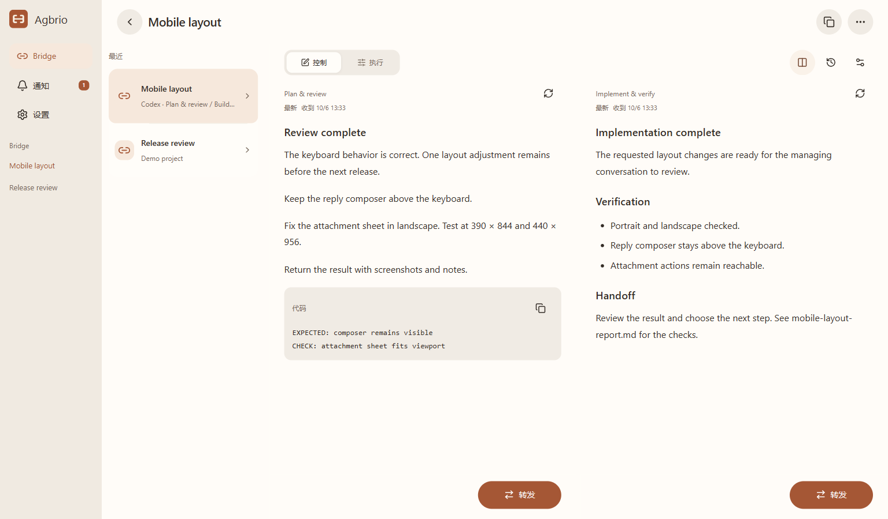
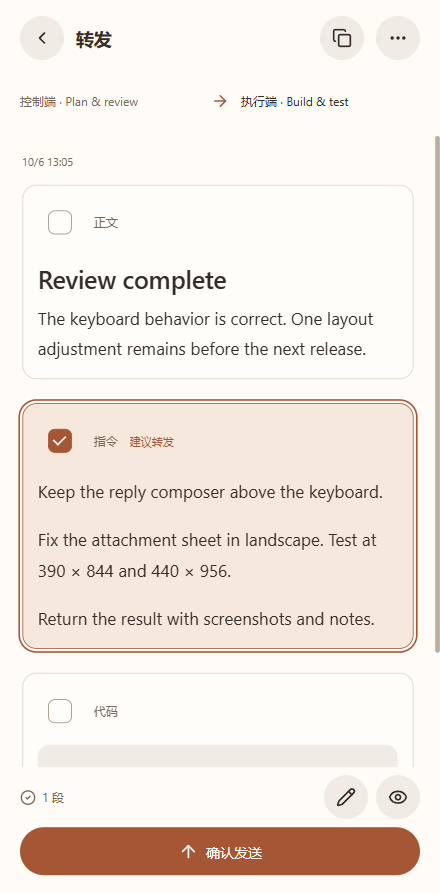
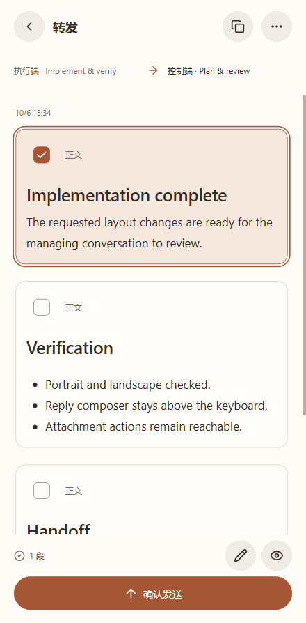
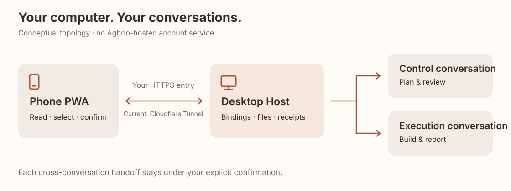

# Agbrio

> **Windows 預覽版0.1.5：** [下載安裝包](https://github.com/geoffrey1111/agbrio/releases/tag/v0.1.5)。包含 Bridge 目前活動端、停止後待審提示、選擇較早原文、Codex 提問回答與跟進，以及設定中的檢查更新。保留可選託管兌換碼和免費自行部署。[更新與驗證範圍](docs/RELEASE_0.1.5.md)。

**Agent Bridge · 讓管理對話與執行對話順暢交接**

[English](README.md) · [简体中文](README.zh-CN.md) · [繁體中文](README.zh-TW.md) · [日本語](README.ja.md) · [한국어](README.ko.md)

如果你已經習慣讓一個 Agent 對話管理專案，另一個對話實際執行，Agbrio 就是圍繞這種用法設計的。

管理對話保留規劃、審查結果、決定下一項任務；執行對話在專案中實作修改，回傳結果與證據。**Bridge 負責把選定的指令、結果與資料在這兩個既有對話之間交接，每次傳送都由你確認。**

手機讓你隨時審閱與確認交接。產品的重點是兩個對話之間的橋梁，遠端存取是到達工作台的方式。

## 發布狀態

**[v0.1.5](https://github.com/geoffrey1111/agbrio/releases/tag/v0.1.5) — MIT 開源 Windows Alpha。** 可下載安裝包與校驗值，或從原始碼建置。乾淨 Windows 安裝及原生首次設定已通過自動驗證，實際遠端 Codex／檔案交接亦已獨立驗證。介面支援繁體中文、簡體中文及英文，可在「設定 → 語言」切換。Mac 與其他 Agent 尚未列為支援平台。[安裝與配對](docs/SETUP.md)。

## 適合已經使用雙對話協作的人

這是為主動分開管理與執行上下文的人準備的工作流程工具。兩個對話與角色由你選擇。Agbrio 不自動分配 Agent，也不讓管理 Agent 自行核准自己的結果。

**指令 → 執行端；結果與證據 → 管理端；最終確認 → 由你完成。**

## 一個對話管理，一個對話執行，Bridge 連接交接過程

 

電腦圖展示同一個 Bridge 的雙端對照；兩張手機圖分別展示「管理端向執行端下發指令」和「執行端向管理端交回結果」的選擇介面。採用真實元件、虛構資料與瀏覽器渲染，不含私人對話，也不代表裝置驗收。範例截圖採用中文介面；應用支援繁體中文、簡體中文及英文。日文、韓文目前僅為介紹文件語言。

## 個人版本目前能做什麼

- **Bridge 雙端協作** — 綁定既有的控制端與執行端對話。查看任一端，並將執行結果交回控制端。
- **選擇內容後交接** — 閱讀完整原文，整塊勾選段落、修改傳送內容、確認接收端，最後一次確認傳送。指令區塊識別只是建議，傳送什麼由你決定。
- **帶齊資料** — 選取的 Codex 交接檔案會複製到接收端專案的 `.aiwr/incoming/<handoff-id>/`，訊息附上相對路徑與 SHA-256。接收端讀取實際的本機副本；這不等於上傳成 ChatGPT 對話附件。
- **通知與原對話回覆** — 開啟特定結果通知，回覆對應的原對話。公開的使用者訊息與 Agent 回覆由舊到新排列，更早的訊息在上方載入。
- **桌面 Host ＋手機 PWA** — 電腦保存綁定、觀察結果與傳送紀錄，手機使用配對後的網頁工作階段。即時讀取與傳送需要電腦開機、保持喚醒並連網。

## 一次完整交接

1. 建立 Bridge，綁定準確的控制端與執行端對話。
2. 閱讀控制端回覆，選擇指令區塊與所需資料。
3. 核對接收端，按一次「確認傳送」。
4. 執行端回傳結果後，審閱並選擇內容，再交回控制端。

## 手機如何連接電腦

[安裝與配對](docs/SETUP.md) · [原始碼建置](docs/BUILD.md) · [MIT 授權](LICENSE)

電腦「設定 → 裝置」可選 Cloudflare Tunnel、Tailscale Funnel、私人 Tailscale Serve 或已有 HTTPS 入口。儲存前驗證 TLS 與本機 Host 身分；可複製部署指令交給自己的 Agent。Funnel/Serve 不需購買網域，使用自己的服務商帳號。Tailscale 真實帳號開通流程仍須獨立驗證，沒有 Agbrio 託管中繼。

## 確認、資料與送達

- 以準確的 conversation／thread 識別碼綁定目標，不依標題、截圖或介面位置猜測。
- 每次交接都需要使用者明確確認，不建立自動循環的管理端／執行端流程。
- 送達不確定時保留該狀態，先核對紀錄，不盲目重複傳送。
- 選定檔案的實際位元組與雜湊才是資料依據；只顯示來源電腦路徑，不會讓遠端接收端自動取得檔案。
- 自行部署仍需信任選用的隧道／網路服務商與 Agent 服務商；手機快取與本機保留訊息也屬私人資料。

## 目前邊界

首批範圍：Windows x64＋Codex＋手機 PWA。介面支援繁體中文、簡體中文及英文。Mac、其他 Agent 與 ChatGPT 瀏覽器流程不屬於已支援發行功能。iPhone 修復回饋與新機安裝驗證分別記錄。

## 建置與參與

先閱讀[安裝文件](docs/SETUP.md)或[建置文件](docs/BUILD.md)。保留精確對話身分、最後一次確認與不確定送達狀態的核對。專案使用 [MIT](LICENSE)，依賴保留[各自的授權及聲明](THIRD_PARTY_NOTICES.md)。

## 聯絡作者與回饋

[作者頁面](mailto:geoffreyzjx@qq.com) · [GitHub](https://github.com/geoffrey1111) · [回報問題](https://github.com/geoffrey1111/agbrio/issues/new?template=bug_report.yml) · [提出工作流程建議](https://github.com/geoffrey1111/agbrio/issues/new?template=feature_request.yml)

使用問題也可以在 Issues 中交流。這是公開管道，請使用示例資料，並於發布前移除私人內容。

[Copyable AI assistant deployment, connection diagnostics and whole-app delegation instructions](docs/ASSISTANT_COPY_PROMPT.zh-TW.md). The app includes the same guide in Settings → AI assistant with your configured MCP URL.
