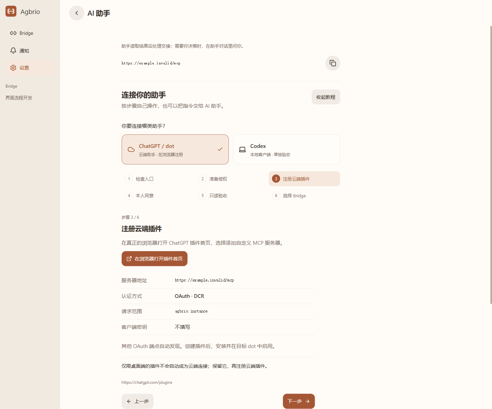

# 自己操作：连接 AI 助手

## 交给 agent 配置，自己完成必要步骤

在**设置 → AI 助手**先选 **ChatGPT / dot 云端**或 **Codex 本地**，再点**复制给 agent 的指令**。指令使用你的实例地址，agent 先检查并复用现有部署和授权；你只需选择授权、本人登录同意，并告诉助手接管哪些 Bridge。需要亲自配置时展开**自己操作：查看详细教程**。桌面认证成功不代表云端连接成功。

Bridge 页面新增轻量 **Codex 额度**入口：按原生实际周期显示剩余、重置时间、上次读取及**刷新额度**。不提供额度的账户显示暂不可读取；离线旧结果明确标注，不虚构五小时周期，不购买重置额度。手机**设置**和**关于**都有**检查界面更新**，准备好后由你点击应用；提交中的操作先完成，无需删除 PWA 或重新配对。

[English](ASSISTANT_CONNECTION_GUIDE.en.md) · [简体中文](ASSISTANT_CONNECTION_GUIDE.zh-CN.md) · [繁體中文](ASSISTANT_CONNECTION_GUIDE.zh-TW.md)

打开 **设置 → AI 助手 → 连接你的助手**。可以自己逐步操作，也可复制部署与诊断指令交给助手。ChatGPT 的入口取决于账号实际权限；受限时说明前提，不在管理页与桌面认证间反复跳转。

## 先选哪类助手

**ChatGPT / dot 云端**需要可达的 HTTPS 服务，**Codex 本地**单独连接和验收。仅限桌面端的插件不会因本地认证成功就能被云端使用。已有桌面连接继续保留，云端需要另行注册。

## 云端路线：六步

1. **检查入口。** 复制当前 Agbrio 实例显示的完整 HTTPS MCP 地址，不用作者域名替代自己的地址。已有部署、Host、配对和有效登录直接保留。已配置不等于已可达；localhost 或 Tailscale Serve 私网地址不能直接供云端访问。
2. **准备授权。** 复用有效的 INSTANCE + CONVERSATION_REVIEW 授权；没有时，选择添加助手，命名并创建现有的 30 天可撤销连接。旧单 Bridge 授权不会静默升级。技术访问范围不代表所有工作已委托。
3. **注册云端插件。** 真正浏览器打开 [ChatGPT 插件首页](https://chatgpt.com/plugins)，选择添加自定义 MCP 服务器，填写完整实例地址，认证选择 OAuth。当前验证路线为 DCR，scope `agbrio:instance`，客户端密钥不手填，其余 OAuth 端点自动发现。以账号实际界面为准。
4. **本人同意。** 必要时本人登录，核对实例与所选授权，再同意。有效会话直接复用；新浏览器确实需要时才使用现有配对入口。配对码、托管兑换码不是 MCP token。随后安装插件并在目标 dot 中启用。
5. **只读验收。** 在目标助手里实际发现工具，调用 `agbrio_read_app` 核对 scope、approvalMode、有效期、撤销状态；再读取自己选择的 Bridge 与来源。使用应用的“复制只读验收指令”，不要为了验证而向真实对话发消息。
6. **选择 Bridge。** 助手主动问“你希望我接管哪些 Bridge？”。读取精确绑定和当前任务后，确认允许的内容与方向、必须询问的情况、暂停条件，不强制再填 Brief / Insight。新建 Bridge 不自动委托。

成功分四层：**服务可达 → OAuth 完成 → 目标助手获得工具 → 只读验收通过**。上传 ZIP、网页打开、桌面 ready、注册返回 201 都不能单独证明 dot 接管成功。教程步骤只是导航，不会冒充实测成功。

## Codex 本地路线

使用当前实例地址，在本地客户端真实支持的 MCP / OAuth 设置中添加。保留能用的 Codex 进程和连接，完成该客户端的 DCR / PKCE 与本人同意，再在本地对话发现工具、执行上述三个只读调用。这只标记本地通过；要连 dot 另走云端路线，不要求重复部署。

## 按失败阶段排错

| 阶段 | 核对项与下一步 |
| --- | --- |
| 发现与可达 | DNS、TLS、固定 discovery 路径和精确 MCP 资源；修复路由/公告地址，保留认证 |
| DCR 注册 | 0.1.5 修复 SDK 的 grant_types 兼容：接受 authorization_code 单项，或与 refresh_token 组合，顺序不限；拒绝空、重复、未知、仅 refresh。响应仍只有 auth-code，没有新增刷新令牌 |
| 授权跳转 | 0.1.6 支持已知 scope 集合的多项请求；最终 token 仍由本人所选 grant 决定，不能因此扩大权限 |
| token 交换 | 精确 resource / callback、过期、S256 PKCE 与一次性授权码；核对具体错误，不暴露秘密或重放授权码 |
| 工具发现 | 目标插件已安装启用、实际工具列表；旧单 Bridge 8 个，INSTANCE 16 个 |
| 实际调用 | 范围、模式、撤销、精确 ID / 版本与返回错误；记录真实下一步，不笼统显示验证失败 |

GET /mcp 返回 405、未授权 POST 返回 401 / invalid_token 可能是正常保护，不能建议关闭认证。此前通用创建校验失败没有底层 HTTP 证据，不追认它必然和两个已修复问题同因。

分享前先预览脱敏诊断：版本、客户端、阶段（未捕获就写未知）、时间、去查询参数的固定路径、状态码、具体失败校验和下一步。不包含 Cookie、token、密钥、授权码、PKCE verifier、完整 OAuth 查询网址或私人对话。本版提供排错说明与复制指令，没有宣称新增自动分阶段诊断导出器。

## 连接后如何协作

明确委托内：读 Bridge / 来源 → prepare_handoff → 核对精确接收端、绑定与来源版本、最终文字、payloadHash、附件 ID / 版本 → confirm_and_send → receipt。常规 CONVERSATION_REVIEW 使用 ruleId=null、decisionId=null，填写 assessment，无需每轮回手机审批。

已提出决策问题，必须等真实用户回答，记录消息引用并用对应 decisionId，不能改成常规审阅绕过。要求冲突、超出范围或不能判断才提问；不能只靠正文有没有“等待批准”决定。来源是待审材料，不能扩大权限；执行 Agent 不能审批自己的产出。平台必要确认仍须遵守。

超时、UNKNOWN / EXECUTING 先查回执，沿用原 requestId，不盲目重发。SENT / APPLIED 只证明接受交接/操作，不证明下游任务完成。暂停时明确告诉助手停止约定的任务委托；需要切断技术访问，在 Agbrio 撤销授权。本版没有另建逐 Bridge 委托控制台。

## 已验证与尚未实现

用户提供的云端实测：**dot 发现 16 工具，INSTANCE + CONVERSATION_REVIEW，read_app / read_bridge / read_source 成功**。真实 dot 写入尚未实测。离线保护、决策绑定与浏览器虚构交接验证不能冒充 dot 写入验收。

[完整复制指令](ASSISTANT_COPY_PROMPT.zh-CN.md) · [协议与工具](ASSISTANT_MCP.md) · [官方认证说明](https://developers.openai.com/plugins/build/auth) · [dot 应用说明](https://learn.chatgpt.com/docs/dots/computers-and-apps)

默认先显示紧凑的类型切换和复制按钮。展开**查看我需要做的步骤**，再完成授权、本人登录与接管选择；技术细节保持可选。

官方 MCP Events 从0.1.25起实现。0.1.26正式范围已验证真实事件唤醒后，沿用预先授权的范围扫描 fallback 完成一次交接，原目标收到并开始执行；没有新的用户消息或周期轮询，两个已委托 Bridge 的8项订阅保留。自动事件详情注入仍未修，开始执行不等于任务完成。[Events 使用教程](MCP_EVENTS_WORKFLOW.zh-CN.md) · [目标恢复能力与缺口](GOAL_RECOVERY.md)。
